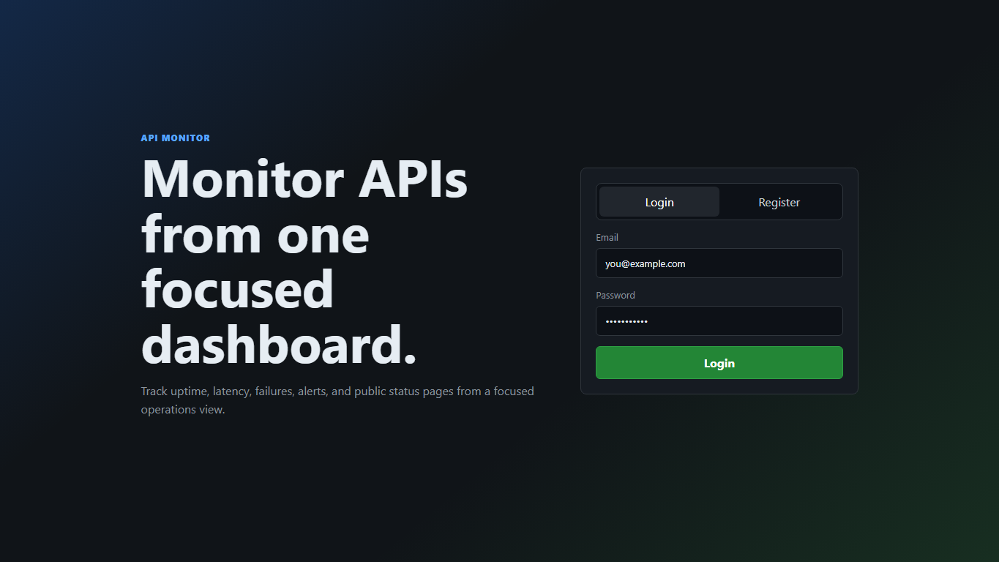
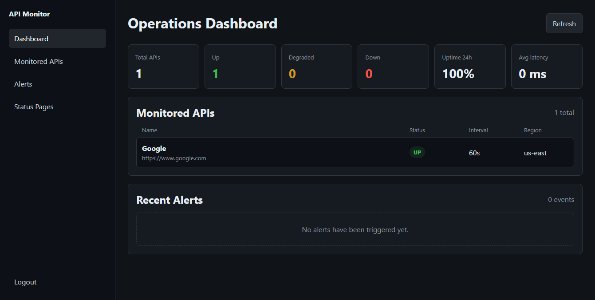

# Distributed API Monitoring System

A Dockerized API monitoring application for registering APIs, scheduling periodic health checks, storing metrics, and reviewing status, alerts, and public status pages from a web dashboard.

## Services

- **API**: Fastify REST API with JWT auth and rate limiting
- **Web**: React dashboard for managing monitors, metrics, alerts, and status pages
- **Scheduler**: BullMQ-based scheduler that keeps API check jobs in sync with the database
- **PostgreSQL / TimescaleDB**: Stores users, monitored APIs, health checks, metrics, alerts, and status pages
- **Redis**: Queue backend for BullMQ

## Tech Stack

| Layer | Technology |
| --- | --- |
| Runtime | Node.js 20 + TypeScript |
| API | Fastify 4 |
| Web | React + Vite |
| Auth | JWT + bcrypt |
| Queue | BullMQ + Redis 7 |
| Database | PostgreSQL 16 + TimescaleDB |
| Infra | Docker Compose |

## Quick Start

From the project root:

```powershell
Copy-Item .env.example .env
docker compose up -d --build
```

Check that the API is running:

```powershell
Invoke-RestMethod http://localhost:3000/health
```

Expected response:

```json
{
  "status": "ok",
  "ts": "2026-05-30T18:25:35.314Z"
}
```

The API runs at:

```text
http://localhost:3000
```

The web dashboard runs at:

```text
http://localhost:3001
```

## Screenshots

### Login



### Dashboard



## Useful Docker Commands

```powershell
docker compose ps
docker compose logs -f api
docker compose logs -f web
docker compose logs -f scheduler
docker compose down
```

To remove containers and the database volume:

```powershell
docker compose down -v
```

## Basic API Usage

Register a user:

```powershell
curl -X POST http://localhost:3000/auth/register `
  -H "Content-Type: application/json" `
  -d '{"email":"you@example.com","password":"password123"}'
```

Log in and copy the returned token:

```powershell
curl -X POST http://localhost:3000/auth/login `
  -H "Content-Type: application/json" `
  -d '{"email":"you@example.com","password":"password123"}'
```

Add an API to monitor:

```powershell
curl -X POST http://localhost:3000/apis `
  -H "Authorization: Bearer <token>" `
  -H "Content-Type: application/json" `
  -d '{"name":"Example API","url":"https://example.com","interval_sec":60}'
```

Replace `<token>` with the JWT returned by the login endpoint.

## API Reference

| Method | Path | Description |
| --- | --- | --- |
| GET | /health | Health check |
| POST | /auth/register | Create account |
| POST | /auth/login | Get JWT token |
| GET | /auth/me | Current user |
| GET | /apis | List monitored APIs |
| GET | /apis/:id | Get one monitored API |
| POST | /apis | Add API to monitor |
| PATCH | /apis/:id | Update API config |
| DELETE | /apis/:id | Remove API |
| GET | /apis/:id/status | Current state and latest check |
| GET | /apis/:id/metrics | Uptime, latency, and error-rate metrics |
| GET | /apis/:id/metrics/hourly | Hourly metric buckets |
| GET | /apis/:id/metrics/latency-percentiles | P50/P75/P90/P95/P99 latency |
| GET | /apis/:id/metrics/checks | Paginated check log |
| GET | /apis/summary | Dashboard-style summary for the current user |
| GET | /alerts/configs/:apiId | Get alert config for an API |
| PUT | /alerts/configs/:apiId | Upsert alert config |
| DELETE | /alerts/configs/:apiId | Delete alert config |
| GET | /alerts/history | Alert history |
| GET | /alerts/history/:id | Alert detail |
| GET | /alerts/status-pages | List status pages |
| POST | /alerts/status-pages | Create public status page |
| DELETE | /alerts/status-pages/:id | Delete status page |
| GET | /status/:slug | Public status page |

## Project Structure

```text
distributed-api-monitor/
├── apps/
│   ├── api/          # Fastify REST API
│   ├── scheduler/    # BullMQ job scheduler
│   └── web/          # React dashboard
├── packages/
│   ├── db/           # PostgreSQL client and migrations
│   ├── queue/        # BullMQ queue config
│   └── types/        # Shared TypeScript interfaces
├── docker-compose.yml
├── package.json
├── tsconfig.base.json
└── turbo.json
```

## Notes

- `.env` is ignored by Git. Commit `.env.example`, not `.env`.
- Docker Compose starts the web dashboard, API, scheduler, PostgreSQL/TimescaleDB, and Redis.
- There is currently no separate worker service in this repository.
